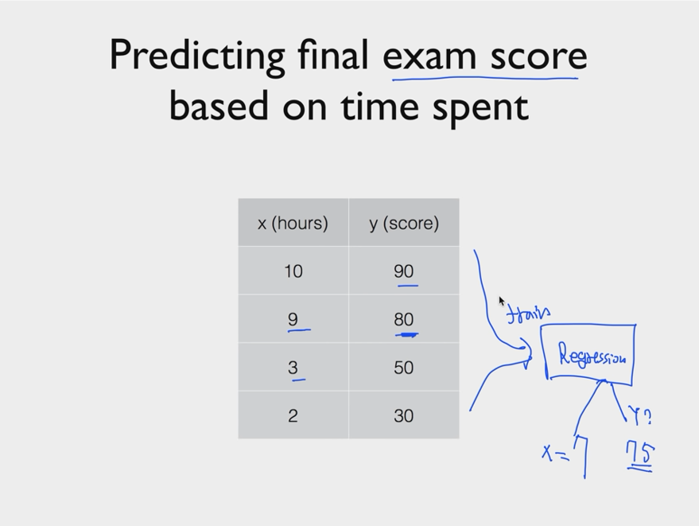
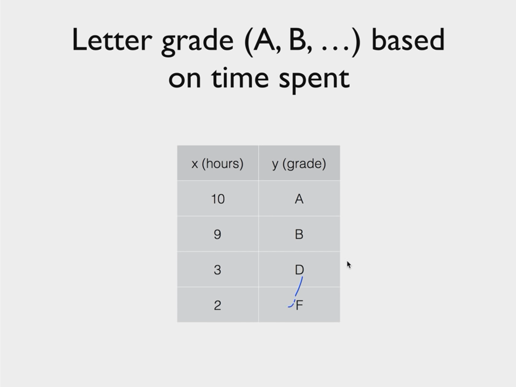
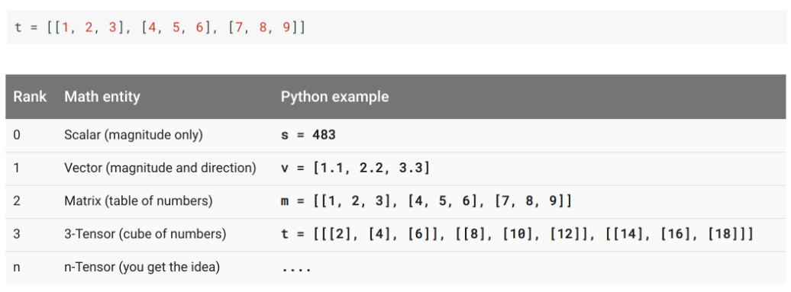
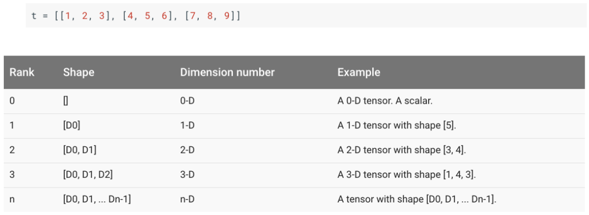
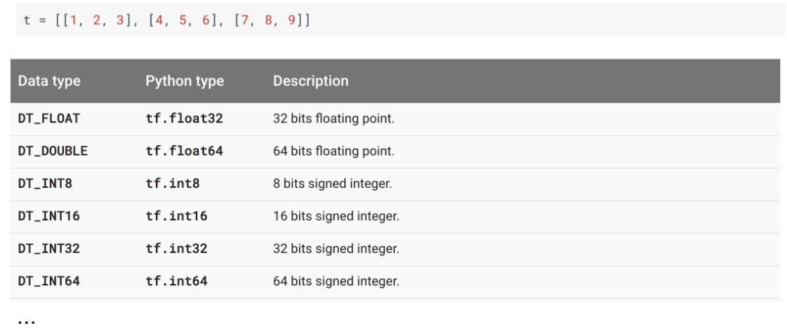
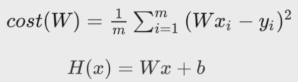

## 개념_TensorFlow\_선형회귀

> https://www.youtube.com/watch?v=BS6O0zOGX4E&list=PLlMkM4tgfjnLSOjrEJN31gZATbcj_MpUm 1 ~ 7

<br/>

## What is ML?

+ Limitations of explicit programming
  + Spam filter : many rules
  + Automatic driving : too many rules
+ Machine Learning: "Field of study that gives computers the ability to learn without being explicitly programmed"

<br/>

## Supervised/Unsupervised learning

+ Supervised learning
  + learning with **labeled** examples - training set

+ Unsupervised learning

  + **un-labeled** data

  + Google news grouping
  + Word clustering

<br/>

## Supervised learning

+ Image labeling
+ Email spam filter
+ Predicting exam score

<br/>

## Types of supervised learning

+ Predicting final exam score based on time spent
  + regression



+ Pass/non-pass based on time spent
  + binary classification(바이너리 분류)
+ Letter grade (A, B, C, E and F) based on time spent
  + multi-label classification



<br/>

## TensorFlow

+ Open source software library for numerical computation using **data flow graphs**.

### What is data flow graph?

+ Nodes in the graph represent mathematical operations
+ Edges represent the multidimensional **data arrays(tensors)** communicated between them.

<br/>

### Install Tensorflow

`pip install --upgrade tensorflow`

`pip install --upgrade tensorflow-gpu` (gpu로 사용할 경우)

`import tensorflow as tf` : 이하 Colab에서 진행한다.

`tf.__version__` : 버전확인

<br/>

### Tensor Ranks, Shapes, and Types



+ Rank는 차원을 의미



+ Shape는 차원의 모양을 의미
  + 예를 들어 주어진 예시는 [3, 3]



+ Type은 주로 float32를 많이 사용하게 된다.

<br/>

## Regression

> "Regression toward the mean"
>
> "전체의 평균으로 되돌아간다"

+ 데이터를 가장 잘 대변하는 직선의 방정식을 찾는 것
  + y = ax + b

### Hypothesis (Linear)

+ 직선을 찾기 위해 가설(직선)을 세운다.
  + H(x) = Wx + b
+ 가장 좋은 가설은?
  + Cost가 가장 작은 W와 b를 찾는다.

<br/>

### Cost

+ How fit the line to our (training) data
+ H(x) - y
  + 양수가 될 수도 있고 음수가 될 수도 있다.
+ 따라서, 이 오차를 제곱해서 평균을 내는 cost(W) 비용 함수를 이용한다. 
  + 오차 제곱의 평균, MSE가 된다.



+ 목표는 이 cost(W)를 minimize하는 W와 b를 찾는 것

<br/>

### Gradient descent

+ TensorFlow에서는 GradientTape()을 통해 구현한다.
  + 주로 with구문으로 함께 쓰이며, with 블록 안에 있는 변수들의 양상을 tape에 기록한다.

```python
import tensorflow as tf

x_data = [1, 2, 3, 4, 5]
y_data = [1, 2, 3, 4, 5]

W = tf.Variable(2.9)
b = tf.Variable(0.5)

# 학습률, 얼마만큼 grad 값을 반영할 것인지
learning_rate = 0.01

for i in range(200):
  with tf.GradientTape() as tape:
    hypothesis = W * x_data + b
    cost = tf.reduce_mean(tf.square(hypothesis - y_data))

  # gradient 메서드를 통해 경사도값, 즉 미분값을 구한다. 
  #첫 번째 인자(cost)인 함수에 대해서 두 번째 인자 리스트의 변수 들에 대해 개별 미분 값을 반환
  W_grad, b_grad = tape.gradient(cost, [W, b])

  # W와 b값을 업데이트: assign_sub는 -=연산자 역할을 한다. 즉, W -= learning_rate * W_grad
  W.assign_sub(learning_rate * W_grad)
  b.assign_sub(learning_rate * b_grad)

  # with ~ 여기까지가 한 걸음
  if i % 10 == 0:
    print("{:5}|{:10.4}|{:10.4}|{:10.6f}".format(i, W.numpy(), b.numpy(), cost))
    

    0|     2.452|     0.376| 45.660004
   10|     1.104|  0.003398|  0.206336
   20|     1.013|  -0.02091|  0.001026
   30|     1.007|  -0.02184|  0.000093
   40|     1.006|  -0.02123|  0.000083
   50|     1.006|  -0.02053|  0.000077
   60|     1.005|  -0.01984|  0.000072
   70|     1.005|  -0.01918|  0.000067
   80|     1.005|  -0.01854|  0.000063
   90|     1.005|  -0.01793|  0.000059
  100|     1.005|  -0.01733|  0.000055
  110|     1.005|  -0.01675|  0.000051
  120|     1.004|  -0.01619|  0.000048
  130|     1.004|  -0.01566|  0.000045
  140|     1.004|  -0.01513|  0.000042
  150|     1.004|  -0.01463|  0.000039
  160|     1.004|  -0.01414|  0.000037
  170|     1.004|  -0.01367|  0.000034
  180|     1.004|  -0.01322|  0.000032
  190|     1.004|  -0.01278|  0.000030
```

<br/>

### Predict

```python
print(W * 5 + b)
print(W * 2.5 + b)

# tf.Tensor(5.0047708, shape=(), dtype=float32)
# tf.Tensor(2.4961886, shape=(), dtype=float32)
```

<br/>

## How to minimize cost

