## 개념_TensorFlow\_선형회귀

> https://www.youtube.com/watch?v=BS6O0zOGX4E&list=PLlMkM4tgfjnLSOjrEJN31gZATbcj_MpUm 1 ~ 7

<br/>

## What is ML?

+ Limitations of explicit programming
  + Spam filter : many rules
  + Automatic driving : too many rules
+ Machine Learning: "Field of study that gives computers the ability to learn without being explicitly programmed"

<br/>

## Supervised/Unsupervised learning

+ Supervised learning
  + learning with **labeled** examples - training set

+ Unsupervised learning

  + **un-labeled** data

  + Google news grouping
  + Word clustering

<br/>

## Supervised learning

+ Image labeling
+ Email spam filter
+ Predicting exam score

<br/>

## Types of supervised learning

+ Predicting final exam score based on time spent
  + regression


+ Pass/non-pass based on time spent
  + binary classification(바이너리 분류)
+ Letter grade (A, B, C, E and F) based on time spent
  + multi-label classification


<br/>

## TensorFlow

+ Open source software library for numerical computation using **data flow graphs**.

### What is data flow graph?

+ Nodes in the graph represent mathematical operations
+ Edges represent the multidimensional **data arrays(tensors)** communicated between them.

<br/>

### Install Tensorflow

`pip install --upgrade tensorflow`

`pip install --upgrade tensorflow-gpu` (gpu로 사용할 경우)

`import tensorflow as tf` : 이하 Colab에서 진행한다.

`tf.__version__` : 버전확인

<br/>

### Tensor Ranks, Shapes, and Types


+ Rank는 차원을 의미


+ Shape는 차원의 모양을 의미
  + 예를 들어 주어진 예시는 [3, 3]


+ Type은 주로 float32를 많이 사용하게 된다.

<br/>

## Regression

> "Regression toward the mean"
>
> "전체의 평균으로 되돌아간다"

+ 데이터를 가장 잘 대변하는 직선의 방정식을 찾는 것
  + y = ax + b

### Hypothesis (Linear)

+ 직선을 찾기 위해 가설(직선)을 세운다.
  + H(x) = Wx + b
+ 가장 좋은 가설은?
  + Cost가 가장 작은 W와 b를 찾는다.

<br/>

### Cost

+ How fit the line to our (training) data
+ H(x) - y
  + 양수가 될 수도 있고 음수가 될 수도 있다.
+ 따라서, 이 오차를 제곱해서 평균을 내는 cost(W) 비용 함수를 이용한다. 
  + 오차 제곱의 평균, MSE가 된다.


+ 목표는 이 cost(W)를 minimize하는 W와 b를 찾는 것

<br/>

### Gradient descent

+ TensorFlow에서는 GradientTape()을 통해 구현한다.
  + 주로 with구문으로 함께 쓰이며, with 블록 안에 있는 변수들의 양상을 tape에 기록한다.

```python
import tensorflow as tf

x_data = [1, 2, 3, 4, 5]
y_data = [1, 2, 3, 4, 5]

W = tf.Variable(2.9)
b = tf.Variable(0.5)

# 학습률, 얼마만큼 grad 값을 반영할 것인지
learning_rate = 0.01

for i in range(200):
  with tf.GradientTape() as tape:
    hypothesis = W * x_data + b
    cost = tf.reduce_mean(tf.square(hypothesis - y_data))

  # gradient 메서드를 통해 경사도값, 즉 미분값을 구한다. 
  #첫 번째 인자(cost)인 함수에 대해서 두 번째 인자 리스트의 변수 들에 대해 개별 미분 값을 반환
  W_grad, b_grad = tape.gradient(cost, [W, b])

  # W와 b값을 업데이트: assign_sub는 -=연산자 역할을 한다. 즉, W -= learning_rate * W_grad
  W.assign_sub(learning_rate * W_grad)
  b.assign_sub(learning_rate * b_grad)

  # with ~ 여기까지가 한 걸음
  if i % 10 == 0:
    print("{:5}|{:10.4}|{:10.4}|{:10.6f}".format(i, W.numpy(), b.numpy(), cost))
    

    0|     2.452|     0.376| 45.660004
   10|     1.104|  0.003398|  0.206336
   20|     1.013|  -0.02091|  0.001026
   30|     1.007|  -0.02184|  0.000093
   40|     1.006|  -0.02123|  0.000083
   50|     1.006|  -0.02053|  0.000077
   60|     1.005|  -0.01984|  0.000072
   70|     1.005|  -0.01918|  0.000067
   80|     1.005|  -0.01854|  0.000063
   90|     1.005|  -0.01793|  0.000059
  100|     1.005|  -0.01733|  0.000055
  110|     1.005|  -0.01675|  0.000051
  120|     1.004|  -0.01619|  0.000048
  130|     1.004|  -0.01566|  0.000045
  140|     1.004|  -0.01513|  0.000042
  150|     1.004|  -0.01463|  0.000039
  160|     1.004|  -0.01414|  0.000037
  170|     1.004|  -0.01367|  0.000034
  180|     1.004|  -0.01322|  0.000032
  190|     1.004|  -0.01278|  0.000030
```

<br/>

### Predict

```python
print(W * 5 + b)
print(W * 2.5 + b)

# tf.Tensor(5.0047708, shape=(), dtype=float32)
# tf.Tensor(2.4961886, shape=(), dtype=float32)
```

<br/>

## How to minimize cost

+ 가설 수식 간략화
  + H(x) = Wx
    + b를 생략
  + 이를 통해 cost 함수 선정

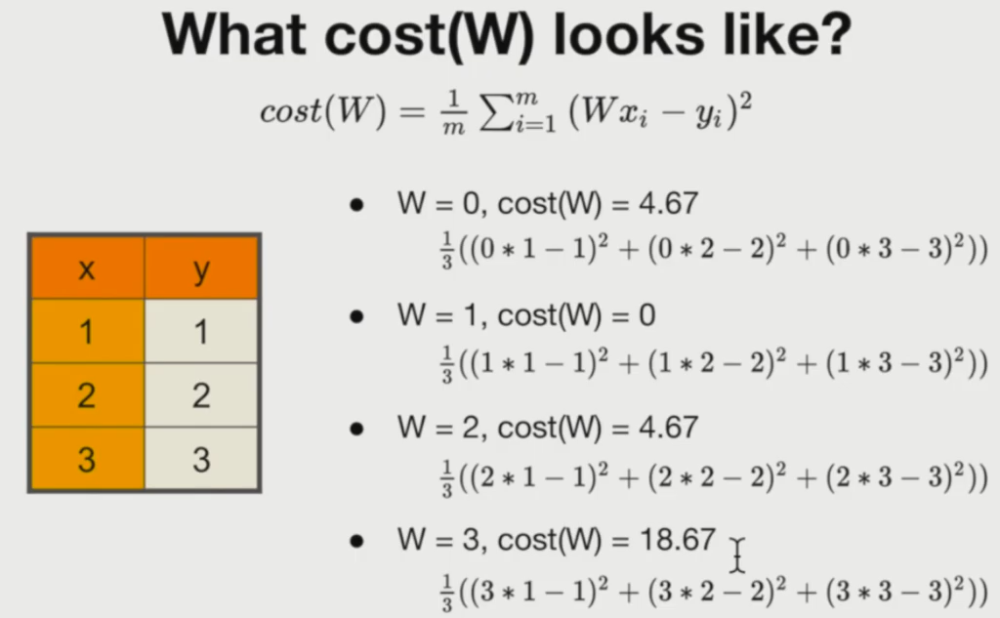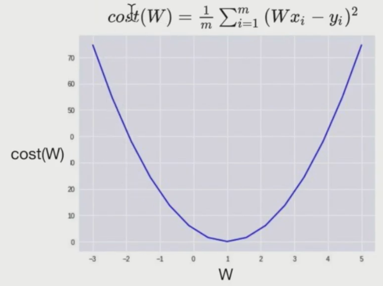

### Gradient descent algorithm

+ For a given cost function, cost(W, b), it will find W, b to minimize cost

1. Start with initial guesses
   + Start at 0, 0 (or any other value)
   + **keeping changing W and b a little bit to try and reduce cost(W, b)**

2. Each time you change the parameters, you select the gradient which reduces cost(W, b) the most possible
3. Repeat
4. Do so until you converge to a local minimum

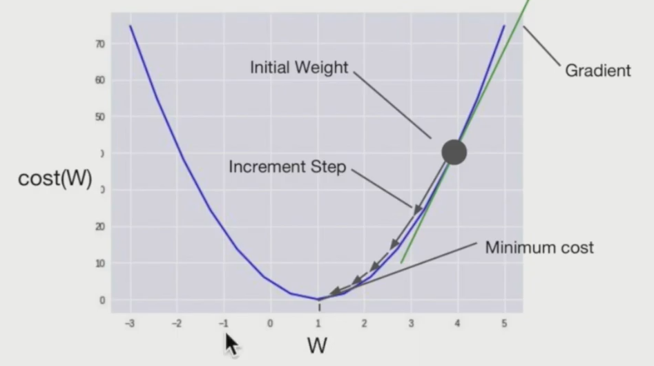

+ 경사를 따라 내려오면서 최저점을 찾는 알고리즘

  + 어디서 시작하던지 상관이 없다.
  + 경사가 클수록 많이 내려온다.

  + 기울기가 음수인 곳에서 시작하면 tf.assign_sub에서 자동으로 음수를 빼게 되므로 기울기가 증가하면서 아래로 수렴한다.
  + 각 경사는 미분을 통해서 구한다.

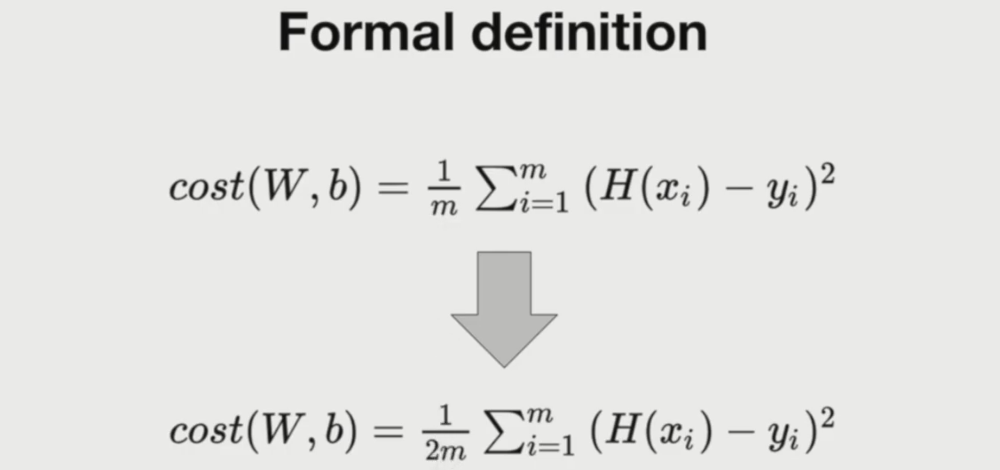

+ Cost 함수를 수정하는 이유
  + 오차 제곱의 평균을 구하기 위해 오차의 개수 m으로 나눌 때, 사실 m으로 나누던 2m으로 나누던 4m으로 나누던 cost함수에는 큰 영향을 주지 않는다.
  + 이후 식의 편의를 위해 미분 시 오차 제곱의 식에서 내려오는 계수 2를 약분해주기 위하여 2m으로 나누는 것으로 수정한다.

+ 이를 통한 Gradient algorithm
  + 알파는 학습률, 그 다음은 W로 편미분하겠다는 미분 기호

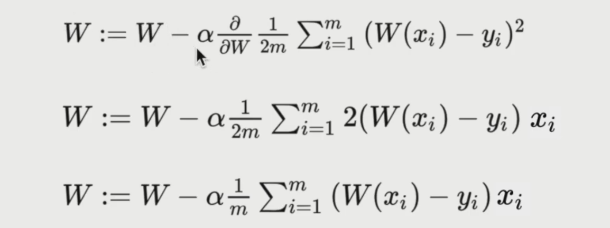

+ 최종 정리

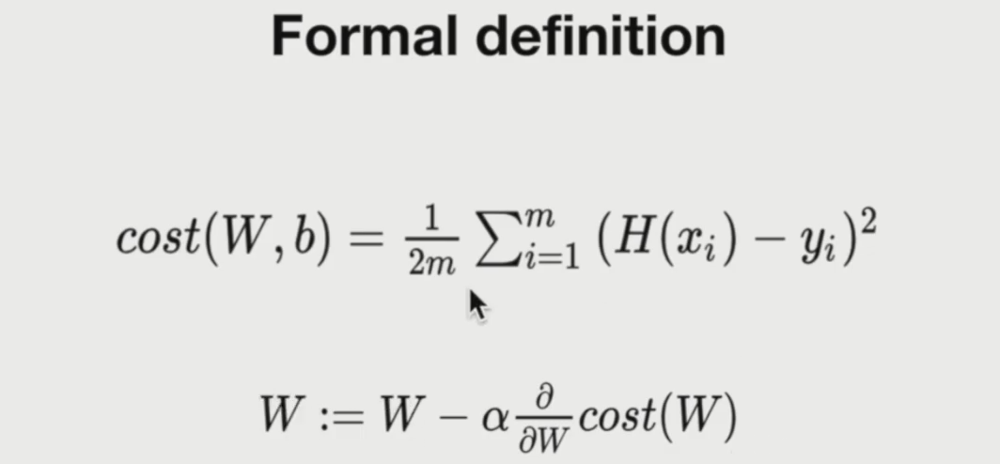

<br/>

### Convex function

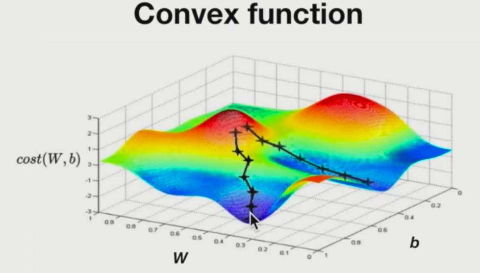

+ 우선, 위 그림은 Convex function이 아니다. (볼록한)
+ 위 그림과 같은 비용함수를 보면, 경사하강법은 주변의 경사를 따라 조금 더 낮은 곳을 찾아가 최저점을 구하는 것인데, 어디서 시작하느냐에 따라 가장 낮은점을 못찾을 수도 있다.
  + 주변을 둘러봤을 때 가장 낮은 지점으로 가기 때문에 초반에 다른 곳으로 빠지면 못갈 수 있다.

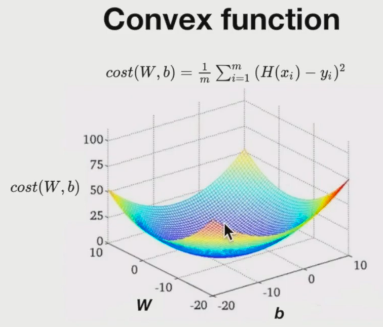

+ 이러한 형태의 Convex function이라면 local minimum과 global minimum이 같기 때문에 편하게 경사하강법 사용이 가능하다.

+ 즉, 경사하강법의 조건은 **Cost Function is Convex**

<br/>

### Revised Tensorflow Code

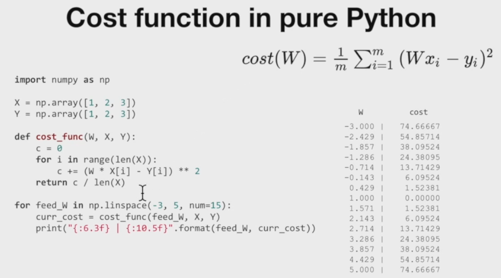

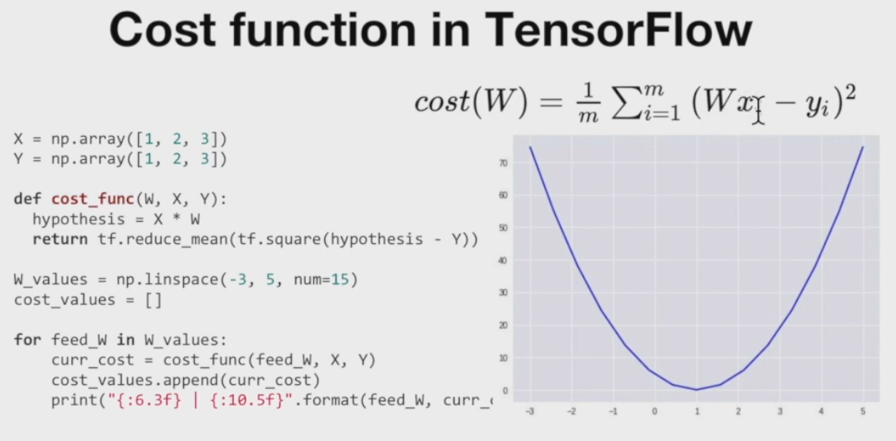

+ 여기에 경사하강법을 적용하면 아래와 같다.**중요**

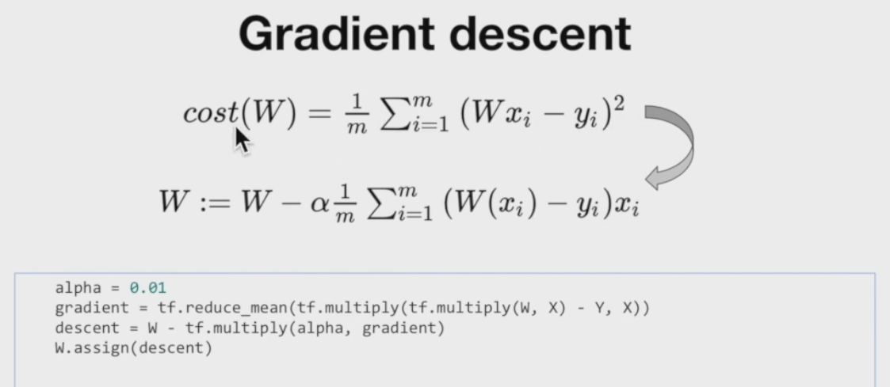

+ 최종 코드

```python
tf.random.set_seed(0) # for reproducibility

x_data = [1., 2., 3., 4.]
y_data = [1., 3., 5., 7.]

# 정규분포를 따르는 random W [1]은 shape를 의미
# W = tf.Variable(tf.random.normal([1], -100., 100.))
# W에 아무거나 줘보자
W = tf.Variable([30.0])

for step in range(300):
  hypothesis = W * x_data
  cost = tf.reduce_mean(tf.square(hypothesis - y_data))

  alpha = 0.01
  gradient = tf.reduce_mean(tf.multiply(tf.multiply(W, x_data) - y_data, x_data))
  descent = W - tf.multiply(alpha, gradient)
  W.assign(descent)

  if step % 10 == 0:
    print('{:5} | {:10.4f} | {:10.6f}'.format(step, cost.numpy(), W.numpy()[0]))
    
    
    0 |  6021.0000 |  27.875000
   10 |  1266.3342 |  13.685345
   20 |   266.4390 |   7.178221
   30 |    56.1631 |   4.194168
   40 |    11.9426 |   2.825734
   50 |     2.6431 |   2.198195
   60 |     0.6875 |   1.910416
   70 |     0.2762 |   1.778446
   80 |     0.1897 |   1.717927
   90 |     0.1715 |   1.690174
  100 |     0.1677 |   1.677447
  110 |     0.1669 |   1.671610
  120 |     0.1667 |   1.668934
  130 |     0.1667 |   1.667706
  140 |     0.1667 |   1.667143
  150 |     0.1667 |   1.666885
  160 |     0.1667 |   1.666767
  170 |     0.1667 |   1.666713
  180 |     0.1667 |   1.666688
  190 |     0.1667 |   1.666676
  200 |     0.1667 |   1.666671
  210 |     0.1667 |   1.666669
  220 |     0.1667 |   1.666667
  230 |     0.1667 |   1.666667
  240 |     0.1667 |   1.666667
  250 |     0.1667 |   1.666667
  260 |     0.1667 |   1.666667
  270 |     0.1667 |   1.666667
  280 |     0.1667 |   1.666667
  290 |     0.1667 |   1.666667
```

+ 혹은

```python
# Gradient descent code2
tf.random.set_seed(0)

x_data = [1., 2., 3., 4.]
y_data = [1., 3., 5., 7.]

W = tf.Variable([30.0])

alpha = 0.01

for step in range(300):
  with tf.GradientTape() as tape:
    hypothesis = W * x_data
    cost = tf.reduce_mean(tf.square(hypothesis - y_data))

  W_grad = tape.gradient(cost, [W])[0]
  W.assign_sub(alpha * W_grad)

  if step % 10 == 0:
    print('{:5} | {:10.4f} | {:10.6f}'.format(step, cost.numpy(), W.numpy()[0]))
```

