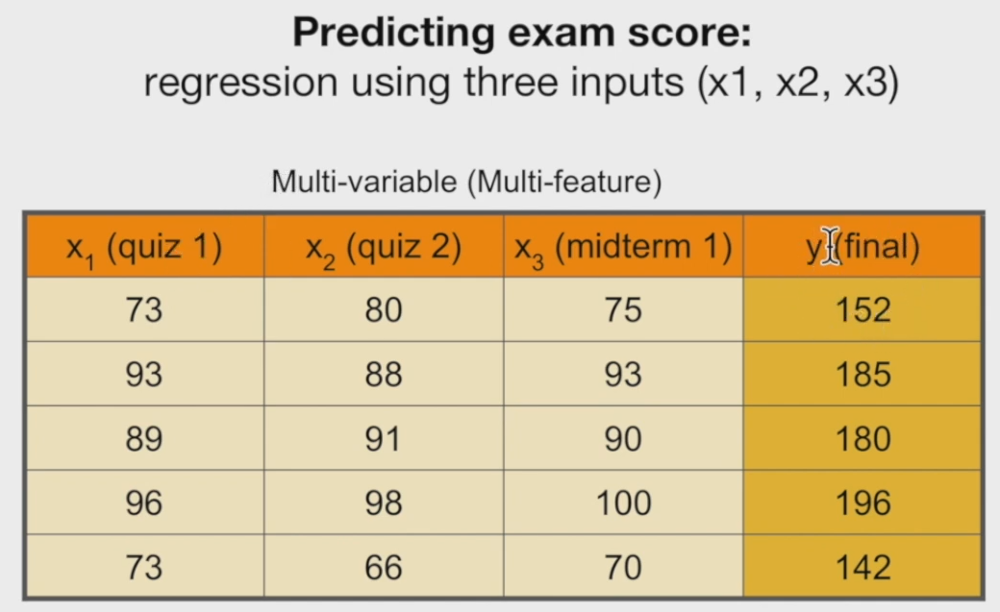
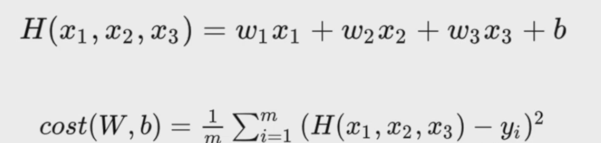
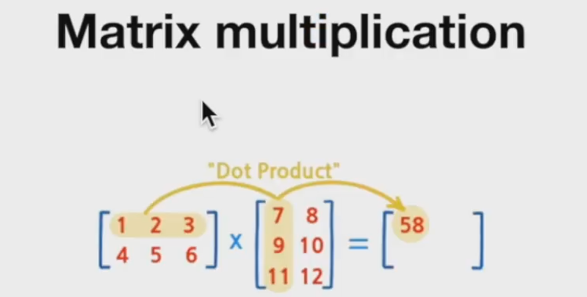
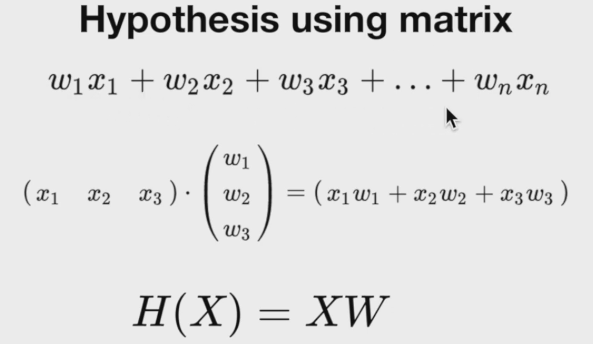
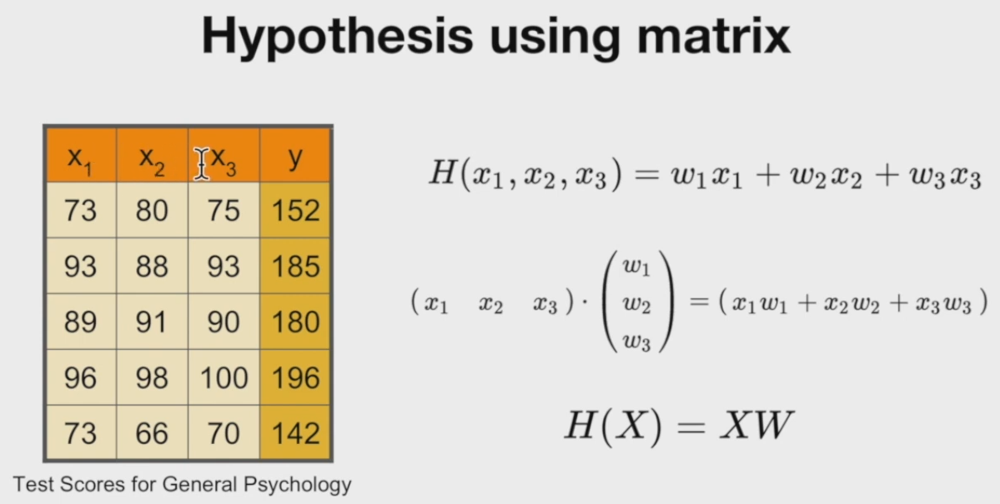
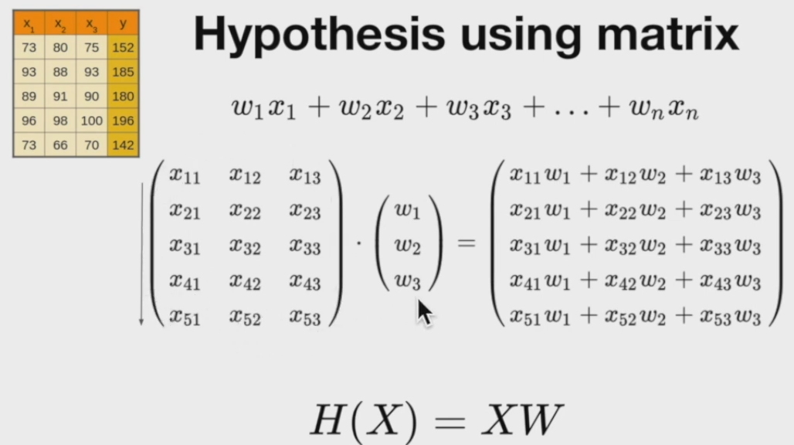
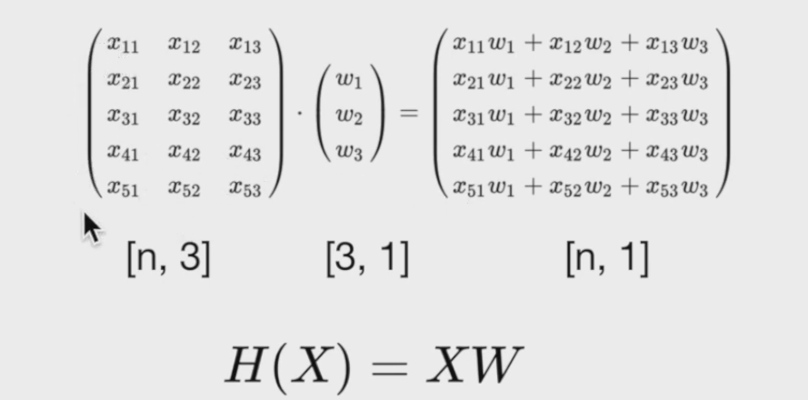

## 다중선형회귀

> https://www.youtube.com/watch?v=BS6O0zOGX4E&list=PLlMkM4tgfjnLSOjrEJN31gZATbcj_MpUm 1 ~ 7

<br/>

## Multi-variable

+ regression using three inputs





+ 만약 변수가 너무 많다면?
  + H(x) = w1x1 + w2x2 + w3x3 + .... + wnxn + b
  + 전부 표현하기 어렵다. 이때 **Matrix**를 사용하여 쉽게 표현할 수 있다.

<br/>

## Matrix

+ 한 행과 열의 곱연산을 Dot Product, 점곱(스칼라곱)이라고 표현한다.





+ Matrix x를 X, Matrix w를 W로 하여 **H(X) = XW**로 간단하게 표현할 수 있다.
  + **여기서 X를 앞에 쓰는 이유는 행렬의 곱에서 x의 행과 w의 열을 곱셈하기 때문이다.**
  + 텐서플로우에서는 꼭 **H(X) = XW**와 같이 쓴다.





+ 데이터가 많아도 행렬을 통해서 편하게 나타낼 수 있는 것이다.
  + 결국 H(X) = XW라는 동일한 식으로 나타낼 수 있게 된다.
+ x행렬의 **열의 수**와 w행렬의 **행의 수**가 일치해야 한다.
+ x행렬의 **행의 수**, w행렬의 **열의 수**만큼의 결과가 나온다.



### TensorFlow code

```python
x_data = [[73., 80., 75.], [93., 88., 93.], [89., 91., 90.], [96., 98., 100.], [73., 66., 70.]]
y_data = [[152.], [185.], [180.], [196.], [142.]]

# [ [], [], [] ]의 shape를 갖는 W
W = tf.Variable(tf.random.normal([3, 1]), name='weight1')
b = tf.Variable(tf.random.normal([1]), name='bias')

learning_rate = 1e-5
for i in range(100001):
  with tf.GradientTape() as tape:
    hypothesis = tf.matmul(x_data, W) + b
    cost = tf.reduce_mean(tf.square(hypothesis - y_data))

  W_grad, b_grad = tape.gradient(cost, [W, b])
  W.assign_sub(learning_rate * W_grad)
  b.assign_sub(learning_rate * b_grad)

 
print(hypothesis)
print("Step {:5} | Cost {:10.4f}".format(i, cost.numpy()))

# tf.Tensor(
# [[151.558  ]
#  [184.61983]
#  [180.78114]
#  [195.94391]
#  [142.05042]], shape=(5, 1), dtype=float32)
# Step 100000 | Cost     0.1912

import numpy as np
print(tf.matmul([[80., 80., 100.]], W) + b)
print(tf.matmul([[73., 80., 75.]], W) + b)

# tf.Tensor([[167.84416]], shape=(1, 1), dtype=float32)
# tf.Tensor([[151.558]], shape=(1, 1), dtype=float32)
```

