## 파일로딩

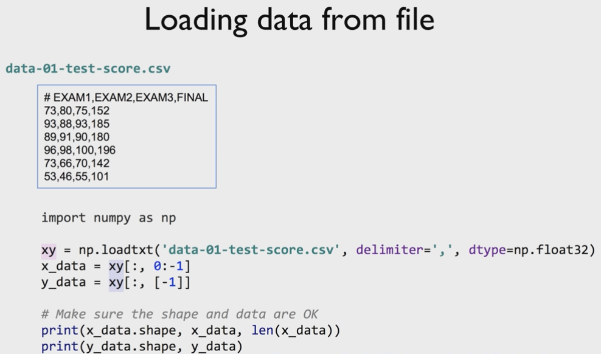

+ numpy의 `loadtxt()`를 이용해서 데이터를 읽어올 수 있다.
  + csv파일은 `,`를 기준으로 데이터를 구분하므로 `delimiter`속성의 값을 `,`로 준다.
  + 데이터 타입은 기본적으로 np.float32, 실수로 준다.
  + xy[:, 0:-1]은 마지막 행을 제외하고 독립변수들로 하겠다는 것
  + xy[:, [-1]]은 마지막 행을 종속변수로 하겠다는 것

### 파일이 매우 커서 올리기 힘든 경우

+ 여러 개의 파일에서 읽어올 수 있게 하는 Queue Runners

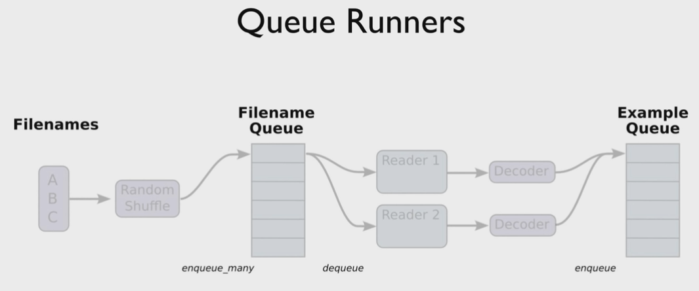

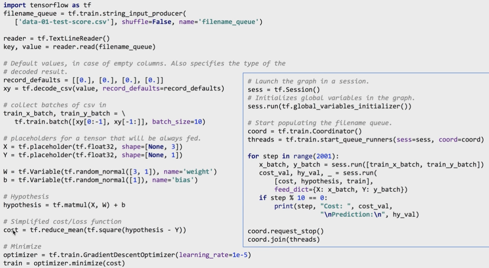

<br/>

<br/>

## Logistic (regression) classification

+ 분류를 선형회귀로 할 때의 문제점

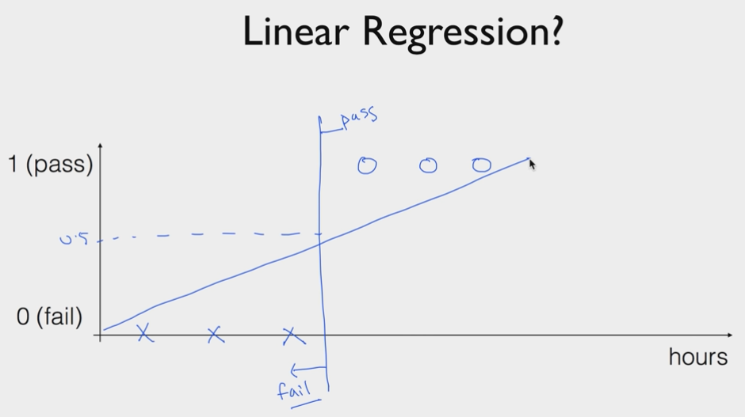

+ 위와 같은 결과에 대해 위와 같이 선형회귀를 그리고 대략 중간쯤을 기준으로 나눌 수 있다.
  + 1시간, 2시간, 3시간 - fail, 4시간, 5시간, 6시간 - pass의 데이터다.
+ 그런데, 갑자기 50시간 pass의 데이터가 들어온다면?

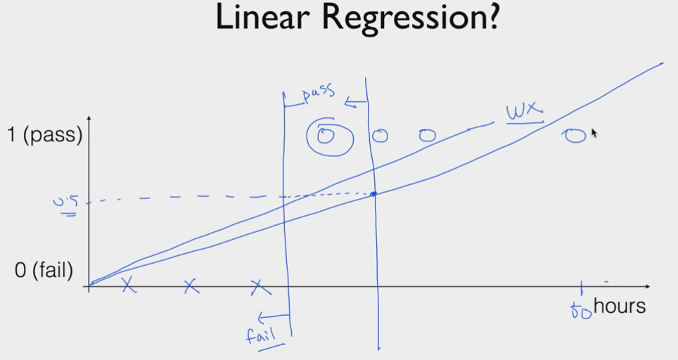

+ 선이 기울어지고 pass/fail 기준선이 바뀌며 기존에 4시간이면 통과여야 하는데, fail의 영역으로 넘어가 버린다.
+ 이것이 첫 번째 문제.
+ 두 번째 문제는, 분류의 경우 0과 1로 출력이 나와야 하는데 선형회귀를 통해 구한 직선의 경우 '직선'이기 때문에 y값이 0보다 작거나 1보다 큰 값이 나올 수 있다.
  + 사실, 이 문제 때문에 첫 번째 문제와 같이 그래프가 특이값에 기울어지는 문제가 발생하게 되는 것일 수도 있다.
+ 이러한 문제들을 해결하기 위한 것이 **무조건 y가 0~1사이의 값을 갖게 하는 로지스틱회귀**

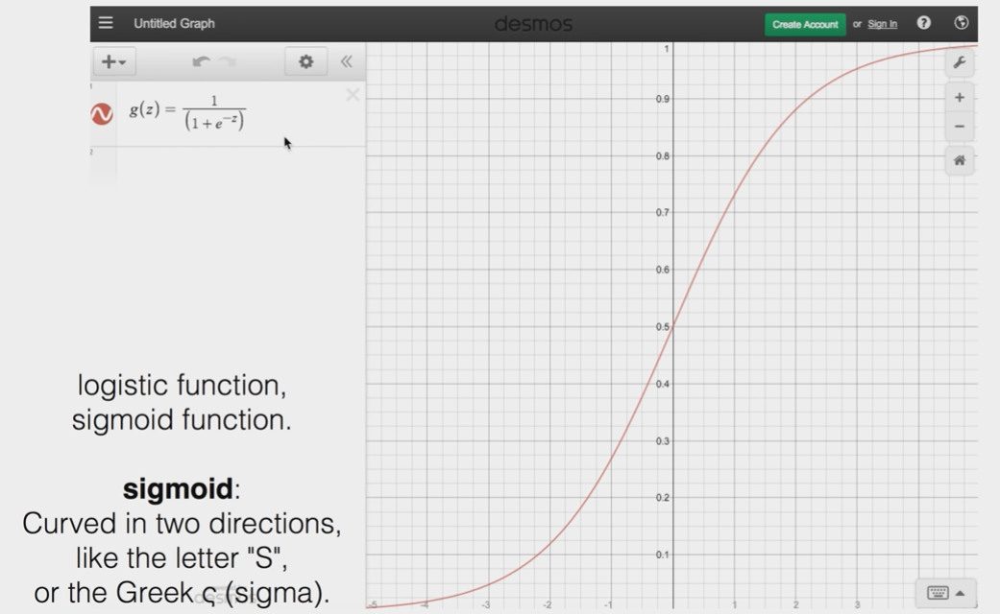

+ 시그모이드 함수 g(z)를 이용하여 어떤 z값이 들어와도 0~1사이의 값을 갖게 한다.
+ 따라서, **z = WX**로 두고, **H(X) = g(z)**로 둔다.
  + 즉, **H(X) = g(WX)** (아래 식에서 T는 큰 의미가 아니다.)

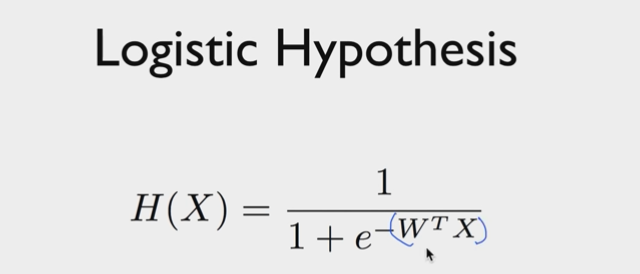

### Cost

+ 기본 hypothesis식이 1차식이 아니기 때문에 Cost식이 Convex하지 않고 울툴불퉁한 선으로 그려진다.

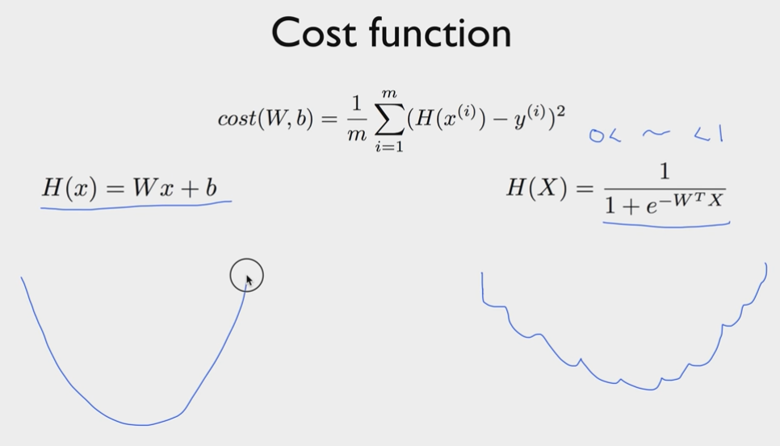

+ 즉, 기존의 경사하강법으로는 W가 어디서 시작하냐에 따라 local minimum과 우리가 원하는 결과인 global minimum이 달라진다.
  + 중간에 평평하고 기울기가 없는 곳을 만나면 멈춰버린다.

+ 그래서, 로지스틱회귀는 다음과 같은 Cost function을 갖는다.

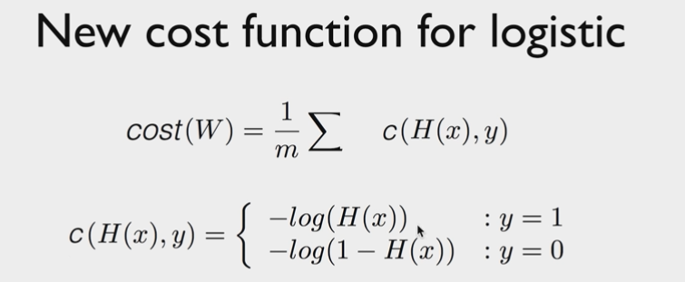

+ 이렇게 하는 이유는 다음과 같다.
  + 로그함수를 통해서 울퉁불퉁한 선을 깔끔한 곡선으로 만들 수 있고, y=1, y=0의 경우의 각각 함수를 그려서 합치면 convex한 형태로 만들 수 있다.
  + y = 1일 때, 우리가 제대로 예측(y = 1로)하면, cost는 -log(1) = 0이다. 반면 잘못 예측(y = 0)하면 cost는 -log(0) = 무한대이다.
  + y = 0일때는 이와 반대이다.

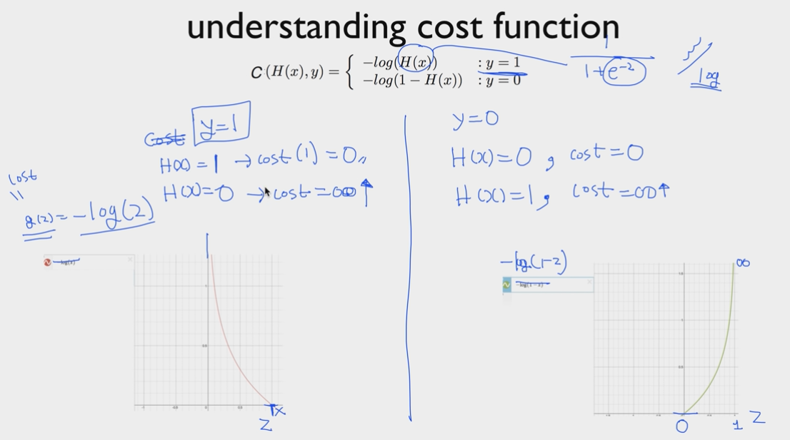

+ 그리고 이 두 식을 한 식으로 정리하자면 다음과 같다.

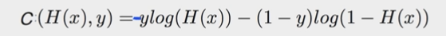

+ 이를 경사하강법한다.
  + `cost = -tf.reduce_mean(Y * tf.log(hypothesis) + (1 - Y) * tf.log(1 - hypothesis))`

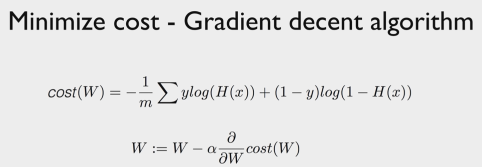

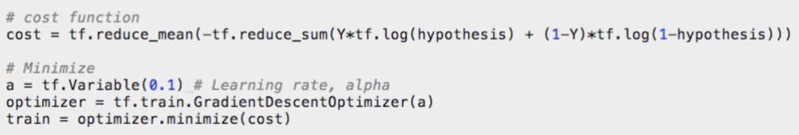

```python
# 여기부터 강의를 따라가는 편의상 버전1을 사용한다.
import tensorflow.compat.v1 as tf
tf.disable_v2_behavior()

x_data = [[1, 2], [2, 3], [3, 1], [4, 3], [5, 3], [6, 2]]
y_data = [[0], [0], [0], [1], [1], [1]]

X = tf.placeholder(tf.float32, shape=[None, 2])
Y = tf.placeholder(tf.float32, shape=[None, 1])
W = tf.Variable(tf.random_normal([2, 1]), name='weight')
b = tf.Variable(tf.random_normal([1], name='bias'))

hypothesis = tf.sigmoid(tf.matmul(X, W) + b)
cost = -tf.reduce_mean(Y * tf.log(hypothesis) + (1 - Y) * tf.log(1 - hypothesis))

train = tf.train.GradientDescentOptimizer(learning_rate=0.01).minimize(cost)

# True if hypothesis > 0.5 else False 이를 tf.cast를 통해서 float32의 형태, 1.0과 0.0으로 바꿔줌
predicted = tf.cast(hypothesis > 0.5, dtype=tf.float32)
accuracy = tf.reduce_mean(tf.cast(tf.equal(predicted, Y), dtype=tf.float32))

with tf.Session() as sess:
  # Initialize TensorFlow Variables
  sess.run(tf.global_variables_initializer())

  # 학습의 과정
  for step in range(10001):
    cost_val, _ = sess.run([cost, train], feed_dict={X: x_data, Y: y_data})
    if step % 200 == 0:
      print(step, cost_val)

  # 정확성 확인
  h, c, a = sess.run([hypothesis, predicted, accuracy],
                     feed_dict={X: x_data, Y: y_data})
  print("\nHypothesis: ", h, "\nCorrect (Y): ", c, "\nAccuracy: ", a)

# 0 0.42993405
# 200 0.41033968
# 400 0.39665508
# ...
# 9800 0.1409866
# 10000 0.13901679

# Hypothesis:  [[0.02645832]
#  [0.1526024 ]
#  [0.2836755 ]
#  [0.7912375 ]
#  [0.9456161 ]
#  [0.9822153 ]] 
# Correct (Y):  [[0.]
#  [0.]
#  [0.]
#  [1.]
#  [1.]
#  [1.]] 
# Accuracy:  1.0
```

