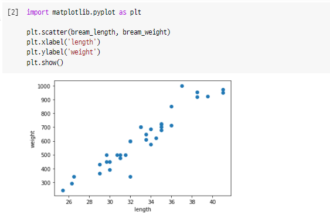
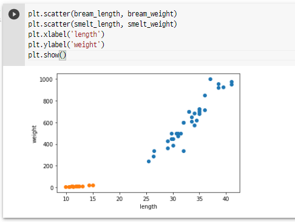

## 생선분류(k-최근접 이웃)

+ 머신러닝에서 2개의 클래스 중 하나를 고르는 문제를 **이진 분류**라고 한다.
+ 도미와 빙어를 분류하는 모델을 만들어보자.

```
// 도미 데이터
bream_length = [25.4, 26.3, 26.5, 29.0, 29.0, 29.7, 29.7, 30.0, 30.0, 30.7, 31.0, 31.0, 
                31.5, 32.0, 32.0, 32.0, 33.0, 33.0, 33.5, 33.5, 34.0, 34.0, 34.5, 35.0, 
                35.0, 35.0, 35.0, 36.0, 36.0, 37.0, 38.5, 38.5, 39.5, 41.0, 41.0]
bream_weight = [242.0, 290.0, 340.0, 363.0, 430.0, 450.0, 500.0, 390.0, 450.0, 500.0, 475.0, 500.0, 
                500.0, 340.0, 600.0, 600.0, 700.0, 700.0, 610.0, 650.0, 575.0, 685.0, 620.0, 680.0, 
                700.0, 725.0, 720.0, 714.0, 850.0, 1000.0, 920.0, 955.0, 925.0, 975.0, 950.0]
```

+ 다음 데이터는 도미의 길이와 무게에 대한 데이터다. 이런 길이와 무게 같은 데이터의 특징들을 **특성(feature)**이라고 한다.
+ 이러한 데이터는 그래프로 보는 것이 더 편하다.
  + x을 길이로, y축을 무게로 그래프로 나타내본다.
  + 이러한 그래프를 **산점도**라고 한다.
    + 산점도: x, y축으로 이루어진 좌표계에 두 변수의 관계를 표현하는 방법
  + Python의 matplotlib를 사용하면 scatter()를 통해 간단하게 그래프로 만들 수 있다.



+ 위와 같이 산점도가 일직선에 가까운 형태로 나타나는 경우를 **선형적**이라고 말한다.

```
// 빙어 데이터
smelt_length = [9.8, 10.5, 10.6, 11.0, 11.2, 11.3, 11.8, 11.8, 12.0, 12.2, 12.4, 13.0, 14.3, 15.0]
smelt_weight = [6.7, 7.5, 7.0, 9.7, 9.8, 8.7, 10.0, 9.9, 9.8, 12.2, 13.4, 12.2, 19.7, 19.9]
```

+ 빙어와 도미를 함께 산점도에 나타내기



+ 이를 바탕으로 머신러닝 프로그램을 만들어보자.

+ **k-최근접 이웃(k-Nearest Neighbors)** 알고리즘을 사용한다.

+ 도미와 빙어의 길이, 무게에 대한 데이터를 하나로 합쳐준다.

  + ```python
    length = bream_length + smelt_length
    width = bream_weight + smelt_weight
    ```

+ 머신러닝 패키지로는 scikit-learn을 사용한다.

  + 이 패키지를 사용하려면 각 특성의 리스트를 세로 방향으로 늘어뜨린 2차원 리스트를 만들어야 한다.

  + ```python
    fish_data = [[l, w] for l, w in zip(length, weight)]
    ```

+ 다음으로, 정답 리스트를 만들어준다.

  + 도미는 1, 빙어는 0으로 표시한다.

  + ```python
    fish_target = [1] * 35 + [0] * 14
    ```

+ k-최근접 이웃 알고리즘을 구현한 클래스를 임포트한다.

  + ```python
    from sklearn.neighbors import KNeighborsClassifier
    ```

+ 사이킷런에서는 `fit()` 메서드가 훈련 역할을 한다. 이 메서드에 fish_data와 fish_target을 순서대로 전달한다.

  + ```python
    # 클래스의 객체를 만든다.
    kn = KNeighborsClassifier()
    
    kn.fit(fish_data, fish_target)
    ```

+ 평가는 `score()`를 통해서 한다. 0에서 1사이의 값으로 성능을 평가한다. (1은 전부 맞춘 경우)

  + ```python
    kn.score(fish_data, fish_target)
    ```

+ 예측은 `predict()`를 통해서 한다.

  + `fit()`과 마찬가지로 리스트의 리스트인 2차원 리스트를 전달해야 한다.

  + ```python
    kn.predict([[30, 600]]) # array([1])
    ```

+ `_fit_X` 속성에 x축의 데이터를, `_y` 속성에 y축의 데이터를 가지고 있다.

  + ```python
    print(kn._fit_X)
    print(kn._y)
    ```

+ k 최근접 이웃 알고리즘은 실제로 무언가 훈련되는 것이 아니라, fit() 메서드에 전달한 데이터를 모두 가지고 있다가 새로운 데이터가 주어지면 가장 가까운 데이터를 참고하여 예측하는 알고리즘이다.

  + 그렇다면 가장 가까운 몇 개의 데이터를 참고할까?

    + 기본적으로 5개다.

    + `n_neighbors` 라는 매개변수를 통해 바꿔줄 수 있다.

    + ```python
      kn49 = KNeighborsClassifier(n_neighbors=49)
      kn49.fit(fish_data, fish_target)
      kn49.score(fish_data, fish_target) # 0.7142... 전체 데이터를 대상으로 하기 때문에 도미만 정답이 된다.
      ```

